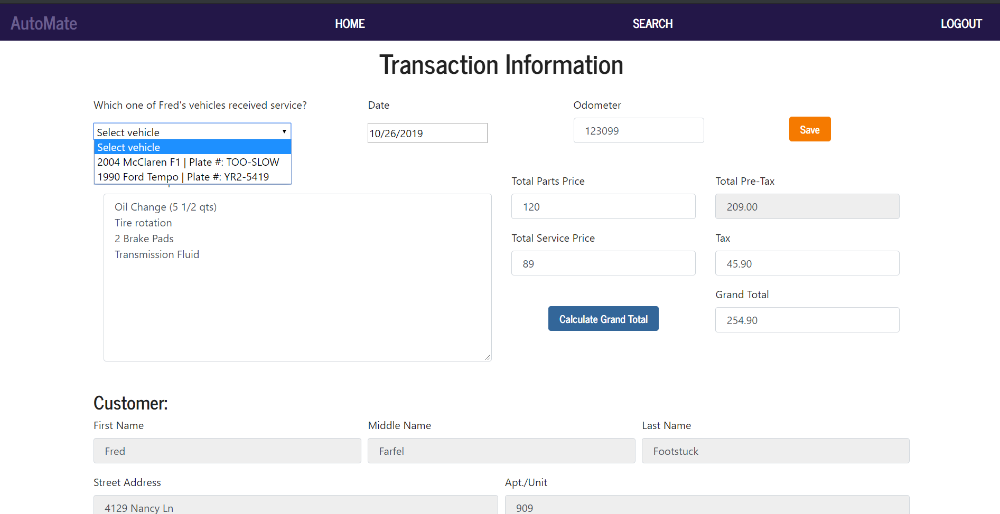

# AutoMate

**AutoMate** is a digital customer data management system developed for the owner of a local tire & auto body shop in the Richmond area. It provides simple CRUD (create, read, update, and delete) functionality for records of customers, vehicles, and service transactions. This application is still under development. Before deploying to final product to our client, we will also add report-generating functionality. Reports will be generated and sent to the business owner automatically every two weeks, but users will also have the option of generating reports manually for timeframes of interest. Additionally, the final version of this application will be packaged as a stand-alone desktop application, and data backups will be configured as a Windows scheduled - once a week the database will be automatically uploaded to a Dropbox folder.

## Try it Out!

Link to [demo version](https://dvavs-automate.herokuapp.com/).

Log in with the following credentials.

*Username:* Manager

*Password:* password

---

## Technologies Used

|**Front End**	|**Server** |**Database**	|**Features**	|
|---	|---	|---	|---	|
|React	|Node	|MySQL (demo)	|Electron*	|
|BootStrap	|Express	|SQLite (production)	|Windows Scheduled Tasks*	|
|D3.js*	|Passport.js	|Sequelize ORM	|Dropbox*	|
|	|Bcrypt.js	|	|PSPDFKit*	|

*Technology to be integrated in future updates.

## How it Works

**AutoMate**'s homepage is a customer entry form (with fields to allow for simultaneous addition of a customer's vehicle), providing for quick on-boarding of new customers to increase efficiency. Additionally, the application allows users to:

* Search for customers using first name, last name, and phone number as search parameters. If no parameters are entered, the search will return all customers.
* Search for vehicles using make, model, year, and plate number as search parameters. If no parameters are entered, the search will return all vehicles.
* View individual customer pages and make edits to their information directly. Also allows users to view all vehicles associated with the given customer, make edits to vehicle information, as well as add new vehicles to the customer record. Provides a link to a an 'Add Transaction' form that automatically populates with the given customer's information.
* View individual vehicle pages and make edits to their information directly.
* View transaction history for a given customer.
* View individual transaction pages and make edits to their information directly.

## Development Team

### Alex Cox
**Roles:** Client interfacing; Business requirements assessment; JavaScript programming; database model definitions; React component construction.

### Dylan Vavra
**Roles:** JavaScript programming; authentication implementation; RESTful API routing; Node & Express server development; database design; React component construction; Heroku demo deployment; ReadMe documentation.

---

## Major Features

### React Front-End

This application is built as a single-page app (SPA) using React. As a result, the UI is very fast, responsive, lightweight, and modular. This was the first application built by the team using React, so it presented an exciting challenge and opportunity to learn.

### User Authentication

**AutoMate** utilizes Passport JS to authenticate users. When a user logs into the application (or registers a new account), their user information is stored locally in the client browser. When they navigate to various pages within the application, that user information is used to test for authorization. If users are not logged in with an authenticated account, they will be unable to access any of the application's inner workings - instead they will be redirected to the login page.

### Password Encryption

In tandem with authentication through Passport JS, users' passwords are encrypted (hashed) with Bcrypt JS. Login attempts hash passwords before comparison to stored values. This prevents the passing of plain-text password information, adding security to user accounts.

### Database Storage and Retrieval

The demo release of **AutoMate** relies on a JawsDB database linked to the deployed Heroku application. This database contains four separate tables, each defined by models using the Sequelize object-relational map (ORM) - one table each for user accounts, customers, vehicles, and transactions. Associations between these models are defined through the Sequelize ORM, and allow for easy joining of tables and integration of their data to display information to users.

In the final production deployment of **AutoMate** a SQLite database will be used in place of MySQL. **AutoMate** will be deployed as a stand-alone desktop application, meaning that users in the client organization will not require access to the internet to use it. SQLite is a serverless database, which is ideal for this design because it will prevent the client from either needing to host their own MySQL server or connect to an external server through the internet. Given that the application itself will not require the internet (save for periodic backups), a serverless database option that is stored locally within the organization prevents potential complications due to internet unavailability.

---

### Features Still Under Development

#### Report Generation

Users will have the option to create reports of transaction history (both in number of sales and in revenue generated) during time periods of interest. They will be able to request data parsed at multiple levels, whether by date, week, month, or summary total within the timeframe specified. Reports will provide figures of the data through the D3.js package.

#### Desktop Application Deployment

**AutoMate** will be deployed as a stand-alone desktop application using Electron.

#### Automatic Database Backup

A Windows scheduled task will be created on the client's host machine that will automatically back up the **AutoMate** database once weekly to a Dropbox account.

#### Search Result Pagination & Table Sorting

Searches for customers and vehicles, as well as tables holding customer transaction history, will present only a limited number of results on a single page to prevent the need for infinite scrolling. Additionally, results tables will offer the user the ability to sort rows by specific columns (e.g., year, last name).

#### Customized Invoice PDF Generation

**AutoMate** will provide users the option to create an invoice from a transaction that will display the data in a format mirroring the client's existing paper records with the PSPDFKit package.
